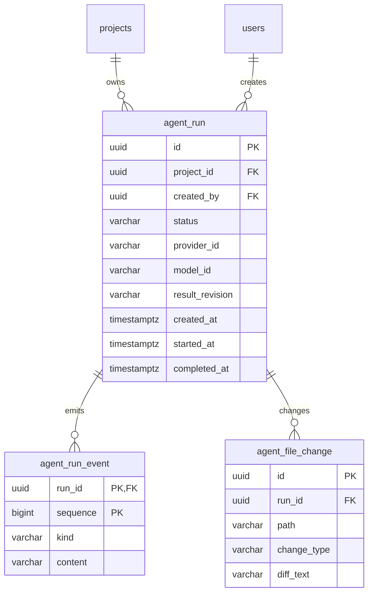

# Surv Agent implementation architecture

**Current implementation (9 October 2026).** Surv Agent edits `${PROJECT_UPLOADS_ROOT}/{public_id}/dev/public/` directly. The project UUID is resolved through an authorized database lookup before the storage path is used. The live app remains in `${PROJECT_UPLOADS_ROOT}/{public_id}/public/` until an explicit publish action.


## Components and flow

```mermaid
flowchart LR
    Client[Project / Surv Agent page] --> API[/v1/agent API]
    API --> DB[(PostgreSQL runs, events, diffs)]
    DB --> Worker[Agent worker]
    Worker --> Model[Ollama or Gemini adapter]
    Model --> Worker
    Worker --> Files[dev/public files]
    Worker --> DB
    Files --> Preview[Authenticated /app/public_id/dev/ preview]
    Preview --> Client
    Client --> Publish[Explicit publish]
    Publish --> Files
    Publish --> Deploy[Project deploy and backup service]
    Deploy --> Live[live public files]
```

1. An Admin or Developer submits a prompt to `POST /v1/agent/{project_id}/runs`. One queued or running run is allowed per project. The worker claims a run with `FOR UPDATE SKIP LOCKED`, checks access and provider configuration, then snapshots `dev/public` into `dev/.runs/{run_id}/baseline` for a later diff.
2. The worker sends the product engineer system prompt, optional approved skill guidance, and the request to the configured model. The model can call `list_files`, `read_file`, `write_file`, and `delete_file`. Those tools access **only `dev/public`**. They validate relative paths, file types, sizes, and link safety. There is no shell or publish tool.
3. The worker compares the baseline to the current `dev/public`, stores file changes and bounded text diffs, and records a business-focused result. The run records a SHA-256 `result_revision` on success. The baseline is then deleted. If a run fails or is cancelled after edits, its changes remain in `dev/public`; the live app remains unchanged. The client loads file changes when the run reaches a terminal state and stops polling.
4. The client obtains a short-lived preview session and shows `/app/{public_id}/dev/` in an iframe. It can request a fresh session and open that page in a new window. The preview reads the same `dev/public` files that the agent edits. Every asset request checks the scoped cookie and current project membership.
5. Publishing is a separate Admin or Developer action through `POST /v1/agent/{project_id}/publish`. Under a project lock, the service rejects an active run, packages the current `dev/public` files, and uses the existing project deployment and backup path. Publishing an unchanged copy of the live files is idempotent. The model cannot publish.

The client lives in `surv-project/apps/client/app/views/agent/`, the API and worker in `src/domains/agent/`, and deployment in `src/domains/projects/`. Provider adapters implement `ModelProvider`; `AGENT_PROVIDER=ollama|gemini` selects the adapter. Anthropic and OpenAI can implement the same `check_ready`/`complete` contract without changing file tools or project authorization.

## Database design

Migration `20261008000001_agent_dev_public.sql` removes `agent_draft` and renames the run's `draft_revision` column to `result_revision`. Named SQL lives in `db/queries/agent/agent.sql`, with generated accessors consumed by `src/domains/agent/repo.py`.



Run state is `queued → running → succeeded | failed | cancelled`; queued runs can also be cancelled. A partial unique index prevents concurrent active runs for one project. Events use a sequence cursor; file diffs are stored per run. There is no separate draft row or draft revision check on publication.

## File layout

```text
{public_id}/
  public/                    # live deployment
  current.zip                # live deployment archive
  dev/
    public/                  # agent reads and edits here; preview serves here
    .runs/{run_id}/baseline/ # temporary comparison snapshot only
    .runs/publish-*.zip      # temporary archive during publication
```

The baseline is not an editable candidate. The worker's file tools write directly to `dev/public`. `index.html` is required for a successful run and for preview/publication. Publishing uses a snapshot ZIP, validates it through project storage, and backs up a prior live deployment. Project file storage must be shared by API and worker processes.

## API surface

| Endpoint | Purpose |
| --- | --- |
| `POST /v1/agent/{project_id}/runs` | Queue a run. |
| `GET /v1/agent/{project_id}/runs`, `GET .../runs/{run_id}` | Read run history and status. |
| `POST .../runs/{run_id}/cancel` | Cancel a run. |
| `GET .../runs/{run_id}/events?after={sequence}` | Read ordered output events. |
| `GET .../runs/{run_id}/changes`, `GET .../changes/{change_id}` | Read changed-file summary and diff. |
| `POST /v1/agent/{project_id}/dev/from-deployment` | Copy live assets into `dev/public`. |
| `POST /v1/agent/{project_id}/preview-session` | Issue a scoped preview cookie and URL. |
| `GET /app/{public_id}/dev/{asset_path}` | Serve authenticated dev assets. |
| `POST /v1/agent/{project_id}/publish` | Publish current dev files; no revision request body. |

## Security and operational limits

File tools accept bounded UTF-8 `.html`, `.css`, `.js`, `.json`, `.svg`, `.txt`, and `.md` files. They reject traversal, hidden path components, symlinks, hard links, and special files. The model has no access to other projects, the live tree, server secrets, network tools, or publication. Preview uses a short-lived HttpOnly cookie, private no-store responses, CSP, and membership checks on every asset. The worker times out after 600 seconds and limits model steps, tool calls, and output size. A failure can leave partial edits in `dev/public`; review the preview and changed files before publishing or copy the live app again to reset it.
