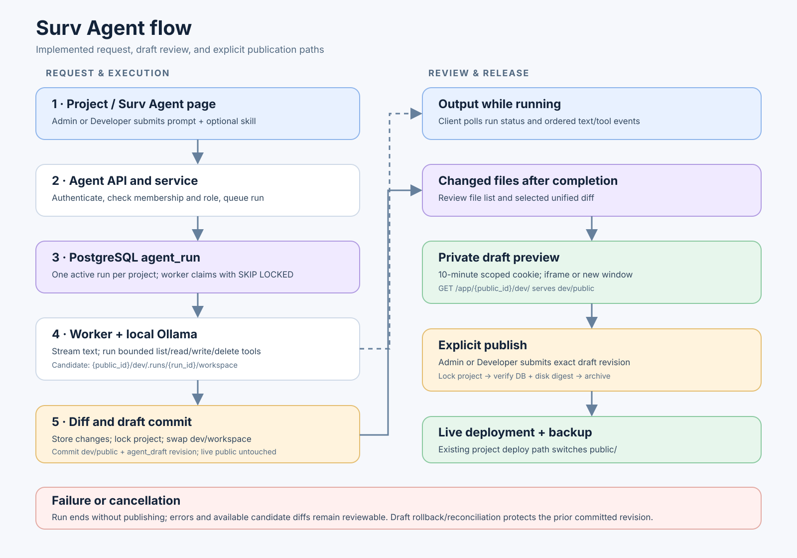
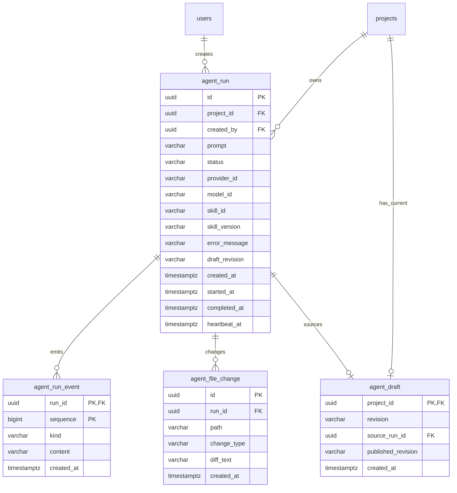

# Surv Agent implementation architecture

**Status:** implemented architecture, as of 8 October 2026. This document describes the current code, rather than proposed behavior. See [ADR-001](ADR-001-SURV-AGENT-INTEGRATION.md), [ADR-002](ADR-002-AI-PROVIDERS.md), the [design plan](SURV_AGENT_DESIGN_PLAN.md), and the [requirements](SURV_AGENT_REQUIREMENTS.md) for decisions and future scope.



[Open the full-size Surv Agent flow diagram](assets/surv-agent-flow.svg).

## System boundary

Surv Agent belongs to a **project**. The client route is `/workspace/:organizationId/projects/:projectId/agent`, with the breadcrumb **Workspace / Project / Surv Agent**. The agent has its own page and domain; it is not a section of the project details page or an API route beneath `/v1/projects`.

| Part | Current implementation | Responsibility |
| --- | --- | --- |
| Client | `surv-project/apps/client/app/views/agent/` and `app/lib/http/agent.ts` | Create and cancel runs, poll run status and output, display diffs after a run ends, show the draft in an iframe, open preview in a new window, request publication. |
| Agent HTTP domain | `src/domains/agent/controller.py`, `preview_auth.py`, `dto.py`, `service.py` | Expose `/v1/agent/{project_id}/...`; delegate preview-session issuance and per-asset authentication to callable functions; delegate publication. |
| Agent persistence | `src/domains/agent/repo.py`, `db/queries/agent/agent.sql`, generated sqlc accessors | Queue and claim runs; persist events, changes, and one current draft per project. |
| Worker | `src/domains/agent/worker.py` | Claim queued work, call the model, execute bounded file tools, record output and changes, commit a successful draft. |
| Provider boundary | `src/domains/agent/providers/base.py`, `ollama.py` | `ModelProvider` protocol and current local Ollama `/api/show` and streaming `/api/chat` adapter. |
| File boundary | `src/domains/agent/workspace.py`, `src/domains/projects/storage.py` | Isolate candidate files, validate paths and sizes, calculate diffs and revision, swap draft files, serve preview, archive for deployment. |
| Existing project domain | `src/domains/projects/service.py`, `repo.py` | Coordinate project-wide lock, deploy archive, record deployment and backup. |

`src/main.py` constructs the repositories and services once per application lifespan. When `AGENT_WORKER_ENABLED` is true, it starts an `AgentWorker` task in that process. PostgreSQL is the shared queue, so more than one application worker can claim work without claiming the same run. Project file storage must be accessible to the process that handles the run, preview, and publish requests.

## End-to-end flow

1. An Admin or Developer posts a prompt (1–8,000 characters) to `POST /v1/agent/{project_id}/runs`. The client currently has no skill picker; the API still accepts an optional allowlisted skill for future use. The service checks organization membership and project role. The database inserts a `queued` run; a partial unique index permits only one queued or running run per project.
2. A worker claims the oldest queued run with `FOR UPDATE SKIP LOCKED`, marks it `running`, and checks that the creator still has access, the selected skill version exists, and the configured Ollama model supports tools. It reconciles any interrupted draft swap and copies `dev/workspace` into `dev/.runs/{run_id}/workspace`.
3. The worker sends the system prompt, optional skill guidance, and user prompt to Ollama. The system prompt frames the agent as a senior Product Engineer, requests Tailwind CSS utility classes, and instructs it to explain the outcome in business terms. With no build step, it directs the agent to use Tailwind's browser runtime. The model can call only `list_files`, `read_file`, `write_file`, and `delete_file`. Tool calls operate on the candidate directory. The worker stores tool summaries for diagnosis; it stores only the final client-facing model summary as a text event.
4. When the model finishes, the worker compares candidate files against `dev/workspace` and stores added, modified, and deleted paths with bounded unified diffs in `agent_file_change`. The UI fetches these changes **after the run reaches a terminal state**. Failed runs can also retain reviewable candidate diffs if comparison succeeds.
5. For a successful run, the worker takes the project-wide advisory lock, verifies `index.html`, computes a SHA-256 revision over sorted file names and contents, swaps the candidate into `dev/workspace` and `dev/public`, then transactionally upserts `agent_draft` and marks the run `succeeded`. A failed database commit rolls the file swap back. An interrupted swap is reconciled on a later run.
6. The client requests `POST /v1/agent/{project_id}/preview-session`, then embeds `/app/{public_id}/dev/` in an iframe. The session-issuance callable checks the current draft and allowed origins, signs the cookie, and returns the URL. An “open preview” button requests a fresh session and opens the same address in a new window. A FastAPI dependency validates the scoped, ten-minute cookie and current membership for each preview asset request before `dev/public` is read. The client and API must share a site for the `SameSite=Lax` cookie; the client normalizes loopback API hostnames in local development.
7. Publication is a separate Admin/Developer action: `POST /v1/agent/{project_id}/publish` with the exact draft revision. Under the same project lock, the service checks database and disk revisions, archives `dev/public`, and passes the archive through the existing deployment and backup path. The deployment record and `published_revision` update share a database transaction. The live app is served separately from the project `public` deployment.

The run state machine is `queued → running → succeeded | failed | cancelled`; a queued run can also become `cancelled`. The worker checks cancellation before model steps, tool calls, and commit. A heartbeat runs every 20 seconds; stale running rows older than two minutes are failed. A run has a 600-second timeout, 40 model steps, 120 tool calls, and 40,000 output characters.

## API and client read model

All `/v1/agent` endpoints use the normal bearer authentication and project membership checks. Admin and Developer can create, cancel, and publish; project members can read runs, events, changes, draft state, and preview, subject to the existing project membership model.

| Endpoint | Purpose |
| --- | --- |
| `POST /v1/agent/{project_id}/runs` | Queue a run; returns HTTP 202. |
| `GET /v1/agent/{project_id}/runs`, `GET .../runs/{run_id}` | List up to 30 recent runs or fetch one run. |
| `POST .../runs/{run_id}/cancel` | Cancel a queued or running run. |
| `GET .../runs/{run_id}/events?after={sequence}` | Poll up to 100 ordered text, tool, status, or error events. |
| `GET .../runs/{run_id}/changes`, `GET .../changes/{change_id}` | List up to 1,000 changed files and fetch a selected diff. |
| `GET /v1/agent/{project_id}/draft` | Get current draft revision, source run, publication state, and preview URL. |
| `POST /v1/agent/{project_id}/preview-session` | Set a scoped preview cookie and return the preview URL. |
| `GET /app/{public_id}/dev/{asset_path}` | Serve private draft assets, including `/dev/` for the root page. |
| `POST /v1/agent/{project_id}/publish` | Publish exactly the requested draft revision. |

The client polls run and event endpoints while work proceeds and stops after a terminal result is loaded. It shows the final business-focused summary after a successful run, then appends a changed-file summary; selecting a file opens its diff in a right-side drawer. Tool activity, model identifiers, and raw worker errors are not rendered in the client output. The draft preview always represents the **current committed draft**, which can originate from a different run than the one selected for history review.

## Database design

Migrations: `db/migrations/20261007000001_agent.sql`, `20261007000002_agent_publish.sql`, and `20261007000003_agent_skill.sql`. Agent queries live in `db/queries/agent/agent.sql` and are consumed through generated async sqlc methods in `AgentRepository`.



| Table | Key rules and purpose |
| --- | --- |
| `agent_run` | UUIDv7 primary key; foreign keys to `projects` and `users`; bounded prompt, provider/model, optional skill provenance, status, error, draft revision, and timestamps. `agent_run_one_active_project_idx` is a partial unique index on `project_id` for `queued` and `running`. `(project_id, created_at DESC, id DESC)` supports history. |
| `agent_run_event` | Composite primary key `(run_id, sequence)`; identity sequence allows cursor polling. `kind` is constrained to `text`, `tool`, `status`, or `error`; content is capped at 4,000 characters. |
| `agent_file_change` | UUIDv7 primary key, unique `(run_id, path)`, constrained type `added`, `modified`, or `deleted`; optional diff is capped at 30,000 characters. |
| `agent_draft` | `project_id` primary key enforces one current draft per project. `source_run_id` identifies the successful run; `revision` is the current file digest; nullable `published_revision` marks the draft already published. A new draft clears that marker. |

Run, event, and change reads join through `projects` and `user_organization_relation` to scope records to a current member. Foreign keys cascade when a project or run is removed, except the `created_by` user reference, which uses `RESTRICT`.

## File layout and consistency

For a project with public ID `{public_id}`, `PROJECT_UPLOADS_ROOT/{public_id}/` contains:

```text
public/                         # Current live deployment
current.zip                     # Live archive used by the project deployment path
dev/
  workspace/                    # Committed editable source baseline
  public/                       # Committed private draft served at /app/{public_id}/dev/
  .runs/
    {run_id}/workspace/          # Isolated candidate during a run
    {run_id}/public/             # Temporary staged draft during commit
    {run_id}/previous-workspace/ # Swap recovery data
    {run_id}/previous-public/    # Swap recovery data
    {run_id}/swap-revision       # Interrupted-swap marker
```

Candidate edits never target the live `public/` deployment. They become visible in `dev/public/` only after a successful run commit. A PostgreSQL advisory lock keyed by project ID serializes draft preparation/commit with manual upload, restore, and agent publication. File swaps and database updates cannot form one filesystem/database transaction, so `AgentWorkspace` uses previous directories and a revision marker for rollback and later reconciliation. The SHA-256 revision is derived from the ordered `(relative path, bytes)` pairs, not from a run ID.

## Security and isolation

- Tool access is limited to relative UTF-8 text files with `.html`, `.css`, `.js`, `.json`, `.svg`, `.txt`, or `.md` suffixes. Paths reject absolute paths, traversal, hidden components, and backslashes; scans reject links, hard links, and special files. Each file is at most 256 KiB; total editable source is at most 10 MiB and also subject to the project archive entry limit.
- The model has no shell, package installation, network tool, cross-project file access, or publish tool. The optional `impeccable` skill is versioned reviewed prompt guidance (`surv-static-1`), not an executable skill script.
- Preview sessions use an HttpOnly cookie scoped to `/app/{public_id}/dev`, `SameSite=Lax`, and `Secure` in production. The signed token expires after ten minutes and binds user, project, public ID, and preview audience. Asset requests recheck membership and draft existence. The preview response disables caching and sets `nosniff`, no-referrer, and a sandbox/CSP with configured frame ancestors. The sandbox allows same origin so preview assets receive the scoped cookie; its script policy permits the Tailwind browser runtime from jsDelivr. A concrete CORS origin is required to issue preview sessions.
- Publication requires the exact draft revision. The service rechecks both database revision and disk checksum under the project lock. The existing deployment path validates the archive and creates a backup of a prior deployed version. Manual upload or restore clears the draft’s published marker.
- Text events and diffs pass through a best-effort secret redactor. This is not a guarantee that arbitrary sensitive content cannot appear in model output or stored diffs; project access controls remain essential.

## Provider and skill extension points

`ModelProvider` is a protocol with `provider_id`, `model_id`, `check_ready()`, and `complete(messages, tools, on_text) -> ModelReply`. `AgentWorker` depends on that interface rather than a provider-specific client. The composition root in `src/main.py` selects `OllamaProvider` or `GeminiProvider` with `AGENT_PROVIDER`. Ollama's `/api/show` verifies tool capability and `/api/chat` streams text and tool calls. Gemini uses `models/{model}` for readiness and `models/{model}:streamGenerateContent?alt=sse` for generation. The adapter parses SSE events, combines their parts in order, and retains function-call IDs and thought signatures across turns. File tools execute only after a complete model turn. `agent_run` records provider/model IDs and skill/version for provenance.

To add Anthropic or OpenAI, implement the same provider contract, translate provider-native tool calls and text into `ModelReply`/`ToolCall`, and add a selection branch to the provider factory. Keep authorization, workspace validation, diffing, and publication in the existing service/worker/workspace layers. Provider choice is process-wide, set by the operator, and bound to each queued run. New skills should be reviewed, allowlisted, versioned guidance and must not expand tool permissions implicitly.

## Current limits and operations

This implementation builds static sites from the allowed text file types. It does not run builds, tests, package managers, or arbitrary skill launchers. Tailwind currently runs through its browser CDN script, which [Tailwind documents for development use](https://tailwindcss.com/docs/installation/play-cdn); publishing a generated site therefore retains a runtime CDN dependency until a CSS build step is added. Run history is capped at 30 rows per request, events at 100 per cursor page, and changed-file listings at 1,000; there is no run-history pagination or retention policy yet. A valid draft requires a root `index.html`. The preview URL must be reachable by the client, and the configured allowed origin must match the embedding client origin for its frame policy.

Configure `AGENT_PROVIDER=ollama|gemini`, `AGENT_WORKER_ENABLED`, `PROJECT_UPLOADS_ROOT`, and a concrete `CORS_ORIGINS` value for private preview. Ollama uses `OLLAMA_BASE_URL` and `OLLAMA_MODEL` (default `qwen3:4b`), which must advertise tool support. Gemini uses `GEMINI_API_KEY` and `GEMINI_MODEL` (default `gemini-3.5-flash`). Gemini generation waits up to 180 seconds between streamed data and retries transient timeouts or overload responses up to three attempts only when no stream event has arrived. A partial stream is never retried. At least one process with `AGENT_WORKER_ENABLED=true` is required to drain the queue. Keep provider settings consistent across workers; changing them before a queued run starts causes that run to fail safely. Monitor failed/stale runs and ensure all API/worker instances that handle the same project see the same project storage.
